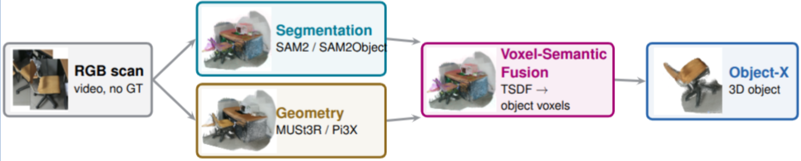

<h6 align="center">CVG - ETH Zurich</h6>

<h1 align="center">Predict Everything: From RGB Sequences to 3D Objects</h1>
<div style="text-align: justify;">
This project implements an automatic preprocessing pipeline that predicts every input
Object-X requires from RGB alone, removing reliance on ground-truth annotations.
Masks and object identities are estimated with SAM2 or SAM2Object; camera poses,
intrinsics and depth are predicted with feed-forward geometry models (MUSt3R, Pi3X).
Two variants are evaluated on 3RScan and ScanNet: SAM2 with MUSt3R, and SAM2Object
with Pi3X.
</div>

#### Workflow overview

<p align="center">
    
</p>
<p align="center">
    <em>Figure 1: RGB-only preprocessing pipeline feeding into Object-X.</em>
</p>

This work introduces an RGB-only preprocessing pipeline that predicts the inputs Object-X
requires — masks, depth, camera poses and intrinsics — directly from video frames, without
any ground-truth annotations. Two variants are implemented and compared: SAM2 with MUSt3R,
and SAM2Object with Pi3X. Both are evaluated on 3RScan and ScanNet (100 scenes each) across
three axes: input geometry quality (bidirectional nearest-neighbour distances, P/R/F1@5 cm),
segmentation quality (class-agnostic IoU matching, micro-averaged F1), and end-to-end
Object-X output fidelity against both the ground-truth mesh and the voxelized input.
SAM2Object with Pi3X achieves the best overall results.

## Setting up

1. Clone the repository:
```bash
git clone git@github.com:<org>/object-x.git
cd object-x
```

2. Install dependencies:
```bash
conda env create -f environment.yaml
conda activate object-x
```

3. Set the two storage roots in `configs/workflows/local_paths.env`:

```bash
export OBJECTX_USER_ROOT="/work/scratch/${USER}"
export OBJECTX_TEAM_ROOT="/work/courses/3dv/team35/${USER}"
```

These paths can point to any accessible storage locations. `OBJECTX_USER_ROOT`
is used for personal datasets, caches, and intermediate outputs;
`OBJECTX_TEAM_ROOT` is used for models, shared environments, and larger shared
outputs. All remaining workflow paths are derived from these two roots
automatically.

The file is loaded by the workflow runner and ignored by Git, so these values
only need to be set once per installation. If a specific resource does not
follow the expected directory layout, its derived variable can still be
overridden in the same file.

4. Configure a scene profile. The example below uses the 3RScan scene
`8f0f144b-55de-28ce-8053-2828b87a0cc9` with the SAM2Object + Pi3X profile:
```
configs/workflows/scene_profiles/scene_8f0f144b_sam2_pi3x.json
```

## Running the Pipeline

All stages are run through the workflow wrapper. Do not call individual scripts directly.

```bash
bash scripts/workflows/run_scene_profile.sh <profile> <action>
```

The full sequence for scene
`8f0f144b-55de-28ce-8053-2828b87a0cc9` is:

```bash
export OBJECTX_USER_ROOT="/work/scratch/${USER}"
export OBJECTX_TEAM_ROOT="/work/courses/3dv/team35/${USER}"

export SAMOBJECT_CHECKPOINT="$PWD/models/sam2ckpt/sam2_hiera_base_plus.pt"
export SAMOBJECT_MODEL_CFG="sam2_hiera_b+.yaml"

PROFILE=scene_8f0f144b_sam2_pi3x

bash scripts/workflows/run_scene_profile.sh "$PROFILE" must3r
bash scripts/workflows/run_scene_profile.sh "$PROFILE" pi3x
bash scripts/workflows/run_scene_profile.sh "$PROFILE" geom-debug      # optional
bash scripts/workflows/run_scene_profile.sh "$PROFILE" samobject
bash scripts/workflows/run_scene_profile.sh "$PROFILE" voxelise
bash scripts/workflows/run_scene_profile.sh "$PROFILE" build-pred-ready
bash scripts/workflows/run_scene_profile.sh "$PROFILE" plot-voxelised  # optional
bash scripts/workflows/run_scene_profile.sh "$PROFILE" features3d
bash scripts/workflows/run_scene_profile.sh "$PROFILE" slat
bash scripts/workflows/run_scene_profile.sh "$PROFILE" u3dgs
bash scripts/workflows/run_scene_profile.sh "$PROFILE" render
```

## Project Organisation

```
├── LICENSE
├── README.md
├── environment.yaml
├── configs
│   └── workflows
│       └── scene_profiles
│           └── scene_8f0f144b_sam2_pi3x.json
├── scripts
│   └── workflows
│       └── run_scene_profile.sh
├── src
│   ├── preprocessing
│   │   ├── geometry          # MUSt3R and Pi3X depth/pose prediction
│   │   ├── segmentation      # SAM2 and SAM2Object mask prediction
│   │   └── voxelisation      # object lifting and 64³ voxel grid construction
│   ├── evaluation
│   │   ├── evaluate_geometry.py
│   │   └── evaluate_sam2object_3d.py
│   └── visualisation
├── figures
└── reports
```

- **configs/workflows/scene\_profiles**: JSON profiles controlling each pipeline stage. Edit the relevant block to tune a single stage without touching Python code.
- **scripts/workflows**: Bash wrappers that orchestrate stage execution in the correct order.
- **src/preprocessing/geometry**: MUSt3R video-mode pose/intrinsic/depth prediction; Pi3X higher-resolution surface reconstruction using MUSt3R poses as prior (Pi3X configuration).
- **src/preprocessing/segmentation**: SAM2 mask propagation and SAM2Object 3D-consistent instance segmentation.
- **src/preprocessing/voxelisation**: back-projects masked depth into world coordinates, accumulates per-object point clouds, and voxelises into the 64³ grid expected by Object-X.
- **src/evaluation**: geometry evaluation (bidirectional nearest-neighbour distances, P/R/F1@5 cm) and class-agnostic 3D instance segmentation evaluation (IoU matching, micro-averaged F1).

## Notes

- MUSt3R must run before Pi3X: the current Pi3X setup uses MUSt3R poses as external priors.
- The example scene must exist below `OBJECTX_BASELINE_ROOT`. Output and cache
  locations can be changed centrally in `configs/workflows/local_paths.env`.
- To switch the SAM2Object checkpoint without editing Python code:
```bash
export SAMOBJECT_CHECKPOINT=/path/to/sam2_hiera_base_plus.pt
export SAMOBJECT_MODEL_CFG=sam2_hiera_b+.yaml
bash scripts/workflows/run_scene_profile.sh scene_8f0f144b_sam2_pi3x samobject
```
- The workflow wrapper is the intended entrypoint. Avoid calling stage scripts directly unless debugging internals.
